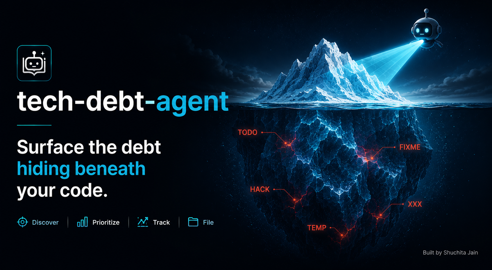

<div align="center">



# tech-debt-finder
> AI agent that surfaces, prioritises, and files your technical debt - without touching your code.

<p>
  <a href="#install">Install</a> •
  <a href="#usage">Usage</a> •
  <a href="#how-priority-works">How Priority Works</a> •
  <a href="#mcp-tools">MCP Tools</a> •
  <a href="#trend-tracking">Trend Tracking</a> •
  <a href="#troubleshooting">Troubleshooting</a>
</p>

<p>
  <a href="https://www.linkedin.com/in/shuchita-jain/"></a>&nbsp;
  <a href="https://medium.com/@coderSJ"></a>
</p>

</div>

---

tech-debt-finder is additive by design. It works alongside your existing setup for GitHub Copilot, Claude Code, and Cursor - it does not replace your coding assistant or modify your source files.

---

An AI agent that scans your repo for tech debt (TODO, FIXME, HACK, TEMP, XXX), prioritises items by age and file activity, and files GitHub issues - with one human gate before anything is created.

Works in GitHub Copilot, Claude Code, and Cursor. No CLI. No package manager. Copy into your repo and go.

## Install

From your project root:

```bash
curl -fsSL https://raw.githubusercontent.com/shuchitajain/tech-debt-agent/main/scripts/install.sh | bash
```

That's it. The script:
- Downloads the agent files into `.ai/tech-debt-agent/`
- Merges the MCP server config into `.vscode/mcp.json`, `.cursor/mcp.json`, `.mcp.json`
- Installs the Copilot agent into `.github/agents/`
- Appends an agent reference to `CLAUDE.md` / `.cursorrules` / `copilot-instructions.md`
- Adds output dirs to `.gitignore`
- Creates the `tech-debt` label in your GitHub repo (if `gh` CLI is available)

Safe to run multiple times - all operations are idempotent.

## Prerequisites

- `uv` - runs the MCP server on demand, no install needed beyond this ([astral.sh/uv](https://astral.sh/uv))
- `GITHUB_TOKEN` in your `.env` - required only if you want to create issues (`repo` or `public_repo` scope)

```bash
echo "GITHUB_TOKEN=ghp_..." >> .env
```

## Usage

Reload your IDE after install to pick up the MCP server, then open agent mode:

```
/tech-debt-agent
```

Or natural language: *"scan this repo for tech debt"*, *"triage tech debt"*, *"find the worst FIXMEs"*.

**What happens:**

1. The agent scans the repo and writes a prioritised `triage-plan.md`
2. **It pauses and shows you the plan** - you decide which items to file
3. You say *"file all high priority"* or *"file items 1, 3, 5"*
4. Issues are created with dedup detection. A `created-issues.md` summary is written.

The agent never modifies source files.

## How priority works

```
score = log(age_days + 1) / log(731) × 0.6
      + min(file_modifications / 50, 1) × 0.4
```

| Bucket | Score | Meaning |
|--------|-------|---------|
| High   | > 0.60 | Old debt in an active file - engineers keep working around it |
| Medium | > 0.30 | Either old but quiet, or recent but hot |
| Low    | ≤ 0.30 | Recent or in a rarely touched file |

The formula is deterministic and reproducible - results are consistent across runs so snapshot diffs are meaningful over time.

## MCP tools

The agent is backed by a Python MCP server. All tools are available to any MCP-aware client.

| Tool | Purpose |
|---|---|
| `generate_triage_report` | Full scan → prioritised JSON by bucket. Primary agent entry point. |
| `check_existing_issue` | Dedup check against GitHub before filing |
| `create_github_issue` | Create an issue (reads `GITHUB_TOKEN` from env) |
| `mark_wontfix` | Exclude a marker from future scans (writes to `.tech-debt-wontfix.json`) |
| `scan_repo` | Raw scan with all markers and summary |
| `get_top_priorities` | Top N markers by score |
| `save_tech_debt_snapshot` | Scan and save a JSON snapshot for trend tracking |
| `compare_tech_debt_snapshots` | Diff two snapshots - resolved/added/net change |
| `explain_marker` | Full details for one marker by file + line |

## Trend tracking

Ask the agent to save a snapshot:
> *"save a tech debt snapshot to snapshots/2026-05-30.json"*

Later, compare two snapshots:
> *"compare snapshots/2026-05-01.json and snapshots/2026-05-30.json"*

Returns resolved count, added count, net change, and `is_improving` flag.

## Suppress false positives

Tell the agent to mark an item as won't-fix (fingerprint is shown in the triage plan):
> *"mark fingerprint a3f92c1d4b7e as won't fix - intentional workaround"*

Writes to `.tech-debt-wontfix.json` - commit this file so the exclusion is shared with the team.

## Troubleshooting

**Tools don't appear in Copilot:** confirm Copilot Chat is in **Agent** mode (mode dropdown at top of chat). MCP tools don't show in Ask or Edit modes.

**Server fails to start:** run `uvx --from git+https://github.com/shuchitajain/tech-debt-agent tech-debt-mcp` in a terminal. If it hangs silently, it's working (waiting for stdio JSON-RPC). If it errors, `uv` may need updating: `uv self update`.

**Restart after config changes:** `Cmd+Shift+P` → `MCP: List Servers` → `tech-debt-mcp` → Restart.

## Development

See [CONTRIBUTING.md](CONTRIBUTING.md).
